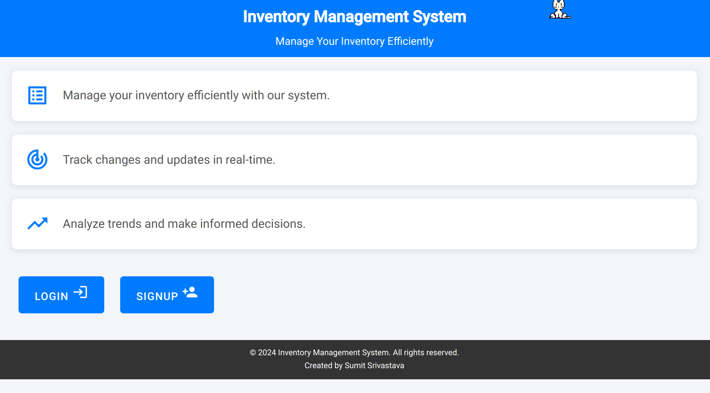
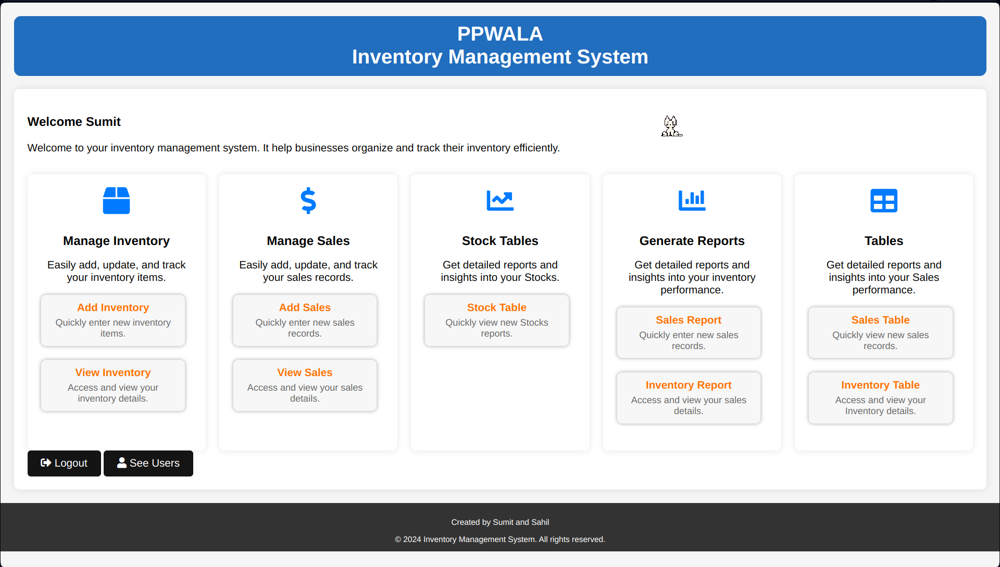
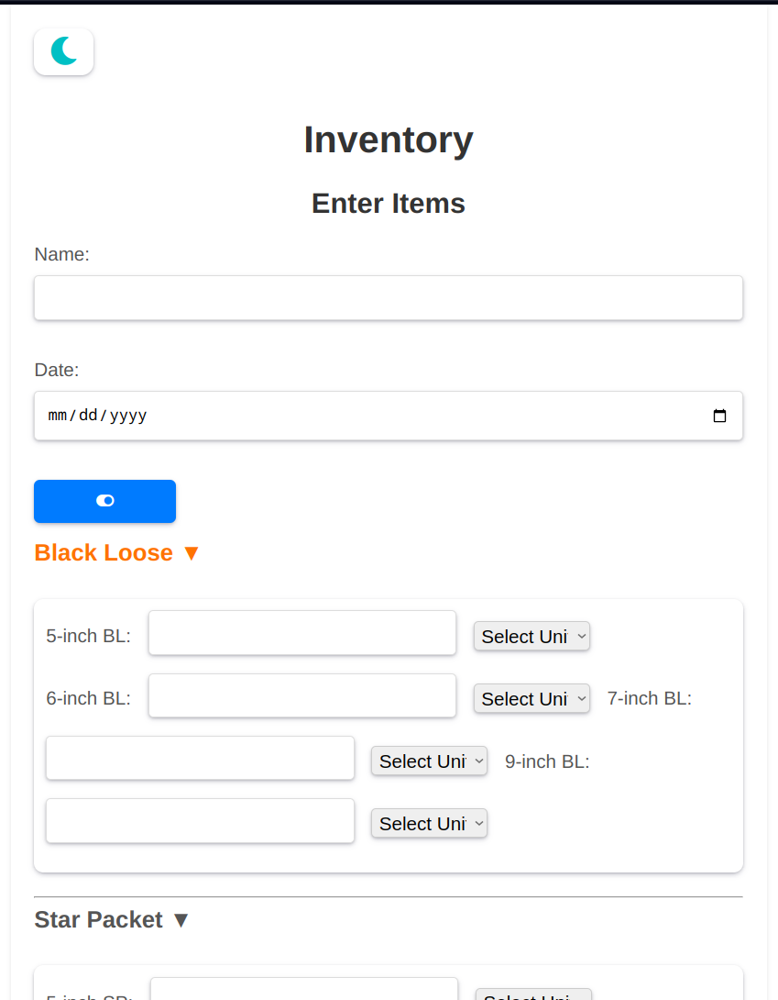
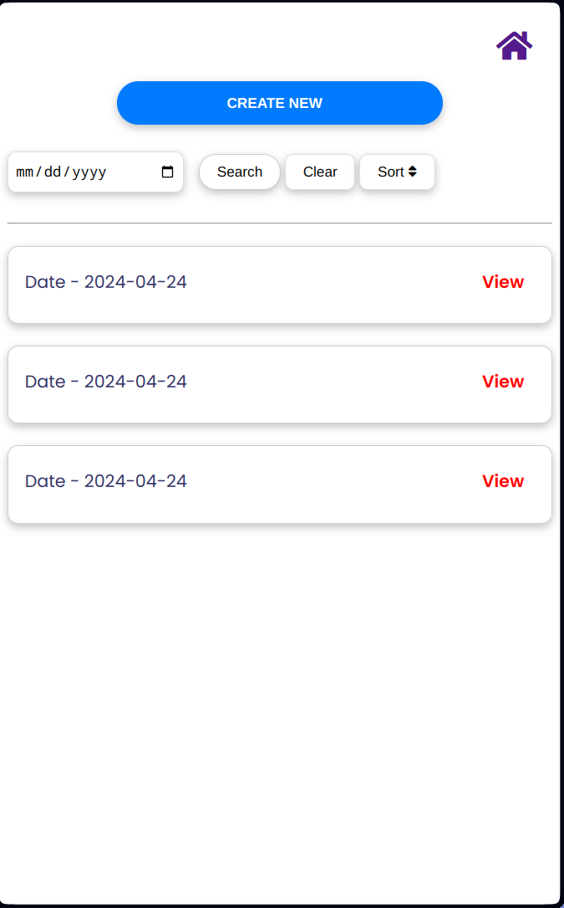
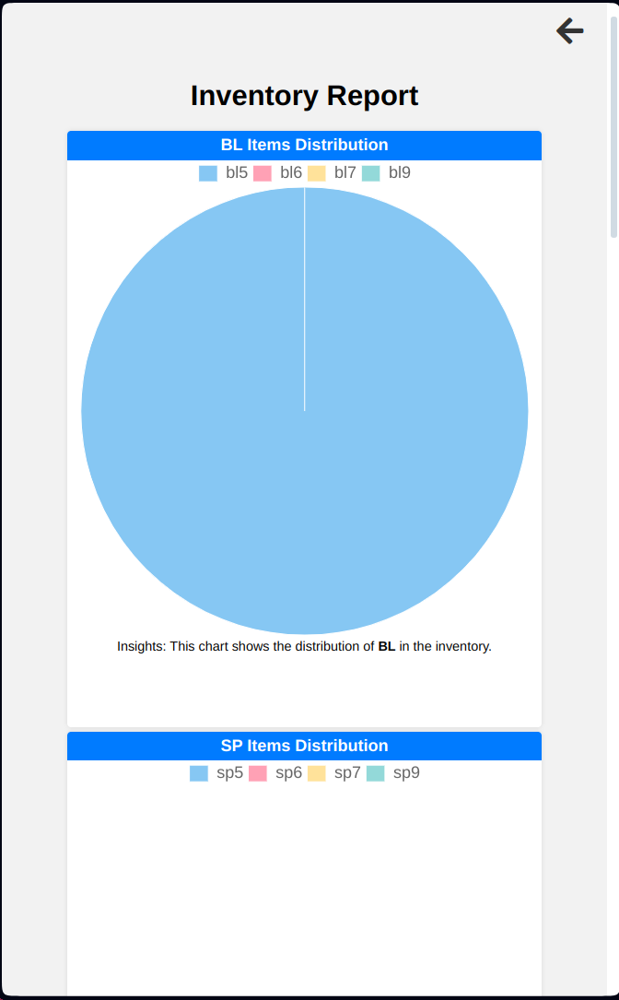
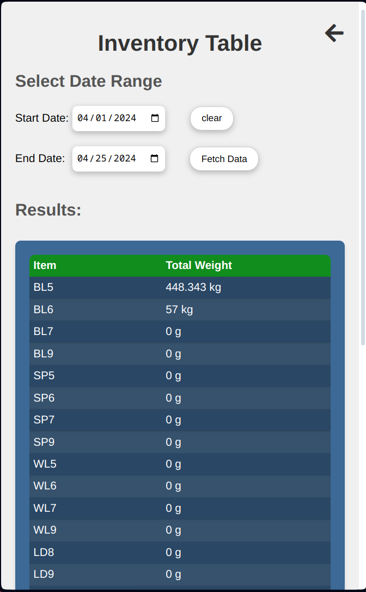
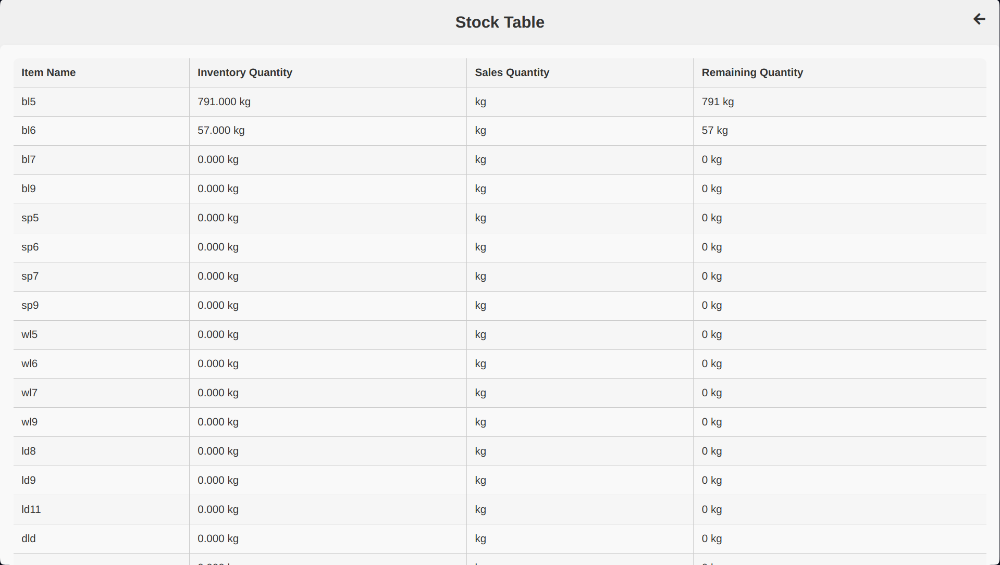
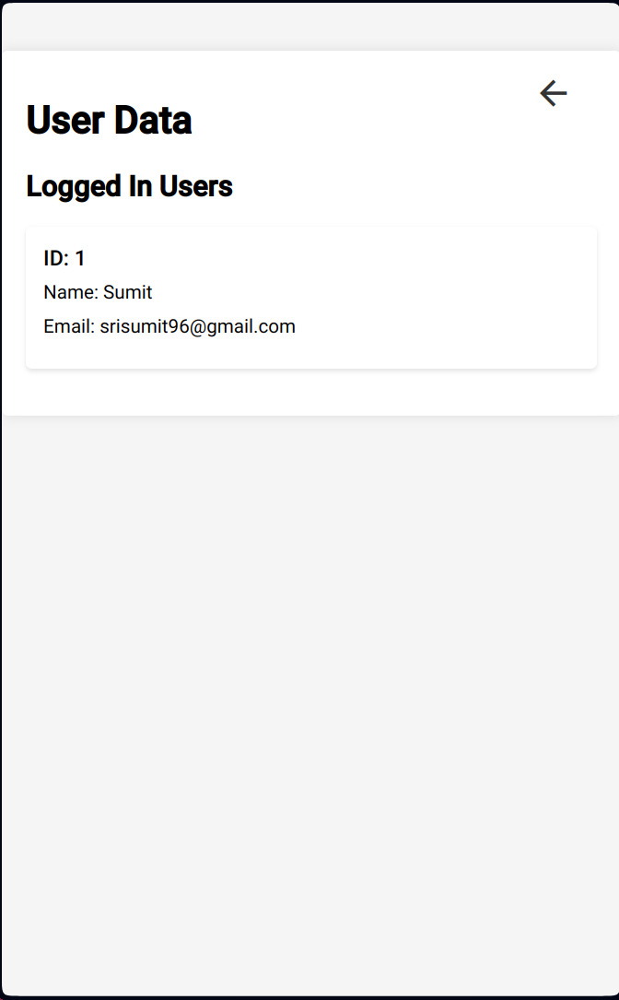

## Web-Based Inventory Management System
cheking master branch
This README.md file showcases a web-based inventory management system designed to streamline inventory and sales data management for businesses.

To visit click on the link -[PPWALA](https://ppwala.000webhostapp.com)

**Key Features:**

- **Inventory Management:**
  - Effortlessly add new inventory items and record quantities for specific dates.
  - Maintain a clear view of current inventory levels through a dedicated table format.
  - Gain a comprehensive understanding of inventory trends using multiple graph types (e.g., bar graphs, pie charts) within a dedicated graph section.
  - Edit existing inventory records to ensure data accuracy.
  - Remove unwanted inventory data for a clean and organized system.
- **Sales Management:**
  - Record sales transactions with ease, specifying dates and quantities.
  - Visualize sales trends using multiple graphs within a dedicated section, allowing for clear identification of sales patterns.
  - Edit existing sales records for data correction purposes.
  - Delete unwanted sales data to streamline record keeping.
- **Search and Sorting:**
  - Effortlessly locate specific inventory or sales data using a powerful search function with customizable criteria.
  - Sort both inventory and sales data by date in either ascending or descending order for a tailored view of your records.

**Enhanced Decision-Making with Data-Driven Insights**

- **Stock Management:**
  - View a dedicated stock management section that provides real-time information on:
    - Current inventory levels for each item.
    - Total number of items sold within a selected date range.
    - Calculated remaining stock based on inventory and sales data, ensuring informed stock replenishment decisions.
- **Reporting:**
  - Generate comprehensive reports on total sales between user-specified start and end dates.
  - Gain insights into inventory levels at any point within a chosen date range through detailed reports.

**User Management (Admin)**

- Admins can view user data associated with recorded inventory and sales data, including user ID and name, for enhanced system control.

**Built with Modern Technology Stack**

This web-based inventory management system is built using the following technologies:

- **Front-End:**
  - HTML: Provides the core structure and content of the web application.
  - CSS: Styles the user interface for a visually appealing and user-friendly experience.
  - JavaScript: Enables interactivity and dynamic behavior within the front-end.
- **Back-End:**
  - PHP: Handles server-side scripting, interacts with the database, and generates dynamic web pages.
  - MySQL: The relational database management system that stores and manages inventory and sales data.

**Security and Error Handling**

This application prioritizes data security and user experience by implementing:

- **Multiple Layers of Error Handling:** Robust error handling mechanisms ensure the system gracefully handles unexpected situations and provides informative messages to users.
- **Security Checking:** Measures are in place to safeguard against potential security vulnerabilities, protecting user data and system integrity.

**Installation**

This web-based inventory management system is designed to be user-friendly and accessible. To get started:

1. Visit the website (link to your website here).
2. Create a new account by following the on-screen prompts.
3. Once logged in, you can begin using the system's features to manage your inventory and sales data.

**Contributing**

We welcome contributions from the community! Here are ways you can get involved:

Bug Fixes: If you encounter any bugs or unexpected behavior in the system, please submit a detailed report on the issue.
Code Improvements: Do you have ideas for improving the codebase? We're happy to review pull requests that enhance the functionality or readability of the code.
Documentation: The clarity of the documentation is essential for users. Feel free to submit improvements to the README.md file or create additional documentation for the project.
Testing: Helping to test the system and reporting any issues you discover is valuable for maintaining a high-quality codebase.

**How to Contribute:**

We follow a collaborative approach to code review and will work with you to incorporate your contributions.

**License**

This web-based inventory management system is distributed under the terms of the MIT License. A permissive license that allows users to freely use, modify, and distribute your code for any purpose, commercial or non-commercial.

MIT License

Copyright (c) <PPWALA>

Permission is hereby granted, free of charge, to any person obtaining a copy of this software and associated documentation files (the "Software"), to deal in the Software without restriction, including the rights to use, copy, modify, merge, publish, distribute, sublicense, and/or sell copies of the Software, and to permit persons to whom the Software is furnished to do so, subject to the following conditions:

The above copyright notice and this permission notice shall be included in all copies or substantial portions of the Software.

THE SOFTWARE IS PROVIDED "AS IS", WITHOUT WARRANTY OF ANY KIND, EXPRESS OR IMPLIED, INCLUDING BUT NOT LIMITED TO THE WARRANTIES OF MERCHANTABILITY, FITNESS FOR A PARTICULAR PURPOSE AND NONINFRINGEMENT. IN NO EVENT SHALL THE AUTHORS OR COPYRIGHT HOLDERS BE LIABLE FOR ANY CLAIM, DAMAGES OR OTHER LIABILITY, WHETHER IN AN ACTION OF CONTRACT.

