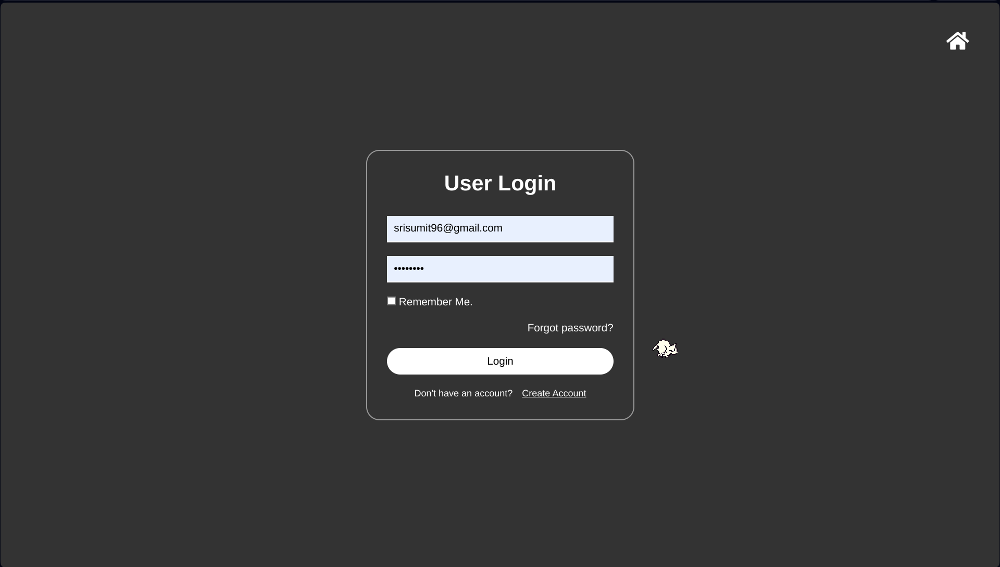

# PPWALA: Web-Based Inventory Management System

This README.md file showcases a web-based inventory management system designed to streamline inventory and sales data management for businesses.

Visit the website: [PPWALA](https://ppwala.000webhostapp.com)  
Download the app: [PPWALA APK](https://sumit7739.github.io/Invenio/app.html)

## Key Features

### Inventory Management
- **Add New Items:** Effortlessly add new inventory items and record quantities for specific dates.
- **View Inventory Levels:** Maintain a clear view of current inventory levels through a dedicated table format.
- **Visualize Trends:** Gain a comprehensive understanding of inventory trends using multiple graph types (e.g., bar graphs, pie charts).
- **Edit Records:** Edit existing inventory records to ensure data accuracy.
- **Delete Records:** Remove unwanted inventory data for a clean and organized system.

### Sales Management
- **Record Transactions:** Record sales transactions with ease, specifying dates and quantities.
- **Visualize Sales:** Visualize sales trends using multiple graphs within a dedicated section.
- **Edit Records:** Edit existing sales records for data correction purposes.
- **Delete Records:** Delete unwanted sales data to streamline record keeping.

### Search and Sorting
- **Search:** Effortlessly locate specific inventory or sales data using a powerful search function with customizable criteria.
- **Sort:** Sort both inventory and sales data by date in either ascending or descending order.

### Enhanced Decision-Making with Data-Driven Insights
- **Stock Management:** View current inventory levels, total items sold, and remaining stock based on inventory and sales data.
- **Reporting:** Generate comprehensive reports on total sales and inventory levels within user-specified date ranges.

### User Management (Admin)
- **Admin Controls:** Admins can view user data associated with recorded inventory and sales data, including user ID and name.

## Built with Modern Technology Stack
- **Front-End:**
  - HTML
  - CSS
  - JavaScript
- **Back-End:**
  - PHP
  - MySQL

## Security and Error Handling
- **Error Handling:** Multiple layers of error handling ensure the system gracefully handles unexpected situations.
- **Security Checking:** Measures are in place to safeguard against potential security vulnerabilities.

## Installation
1. Visit the [PPWALA website](https://ppwala.000webhostapp.com).
2. Create a new account by following the on-screen prompts.
3. Once logged in, you can begin using the system's features to manage your inventory and sales data.

## Contributing
We welcome contributions from the community! Here are ways you can get involved:
- **Bug Fixes:** Submit detailed reports on any bugs or unexpected behavior.
- **Code Improvements:** Submit pull requests to enhance functionality or readability.
- **Documentation:** Improve the README.md file or create additional documentation.
- **Testing:** Help test the system and report any issues discovered.

### How to Contribute
We follow a collaborative approach to code review and will work with you to incorporate your contributions.

## License
This web-based inventory management system is distributed under the terms of the MIT License. See the [LICENSE](LICENSE) file for more details.

---

## Quick Links to Images
Click on the images to view in full size.

  
  
  
  
  
  
  
  
  
  

---

Feel free to explore and enjoy the streamlined inventory and sales management experience with PPWALA!
